# Helm-Chart-Basics-Getting-Started-Hands-on

Helm is the package manager for Kubernetes. It uses charts that define a set of Kubernetes resources to deploy.

In his repo I will show you how to:

* Install helm on windows
* Start minikube and sync docker-env
* Test minikube locally
* Create your first helm chart
* Check syntax errors before deployment using linter
* Inspect and change default values
* Access the nginx app on your browser locally
* Package our chart to send it a repository

Next on: Store Helm charts in Artifact Registry

### Before you begin
* You should have an access to a CLI
* Docker Desktop (with Kubernetes enabled)
* You have a  Minikube cluster installed and configured.
* You should also have Helm installed and configured.

Let's start by installing helm on windows

## Install helm on windows

```bash
 curl -fsSL -o get_helm.sh https://raw.githubusercontent.com/helm/helm/main/scripts/get-helm-3
 chmod 700 get_helm.sh
 ./get_helm.sh
```

## Start minikube and sync docker-env

Let's first create a repo with gh with the following command:

```bash
gh repo create
```

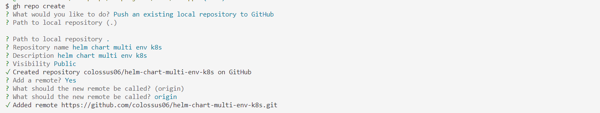

```bash
minikube start
eval $(minikube docker-env)
```

## Test minikube locally

Then test a simple nginx app locally.

```bash
k apply -f k8s_dev.yaml
k get deploy,po,no
```
You can also get pods specifying label:

```bash
k get pods -l app=nginx
```

You can expose the Deployment:

```bash
k expose deployment nginx-deployment --type=NodePort --port=80
k get svc
minikube service nginx-deployment
```

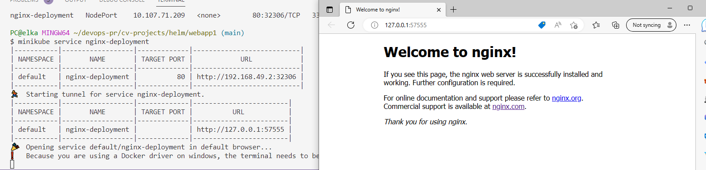


You can display the deployment running the following command:

```bash
alias k=kubectl
k get deploy
```
Let's clear the resources and move on to the helm section.

```bash
minikube delete
```
## Create the skeleton/first chart

Let's create our first helm chart. We will ake a new directory called `nginx-app`. Change directory into it and run the following command to create a simple chart that will deploy an Nginx pod.

```bash
helm create nginx-app
```

<!-- We are going to delete the following files/folders:

* templates/tests folder
* templates/ingress.yaml
* templates/NOTES.txt
* templates/serviceaccount.yaml

```bash
rm -rf nginx-app/templates/*
``` -->

<!-- We are also going to delete the following file contents so that we can write from scratch

* templates/deployment.yaml
* templates/hpa.yaml
* templates/service.yaml
* templates/_helpers.tpl -->

we will keep everything as it is for now, and deploy our first chart.

```bash
helm install mywebapp-release ./nginx-app/
```

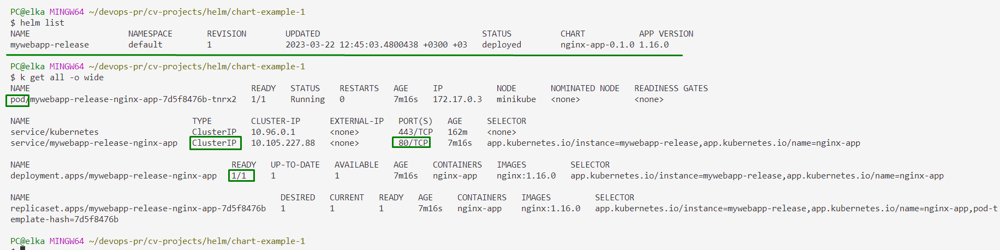

## Start linter to check syntax errors before deployment

`helm lint ./nginx-app/`


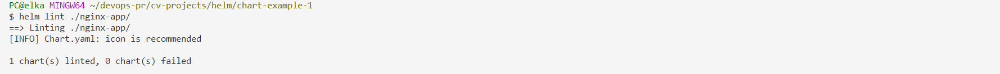

## Changing the default values

When we inspect our values we see that the default service type is set to `ClusterIP`.

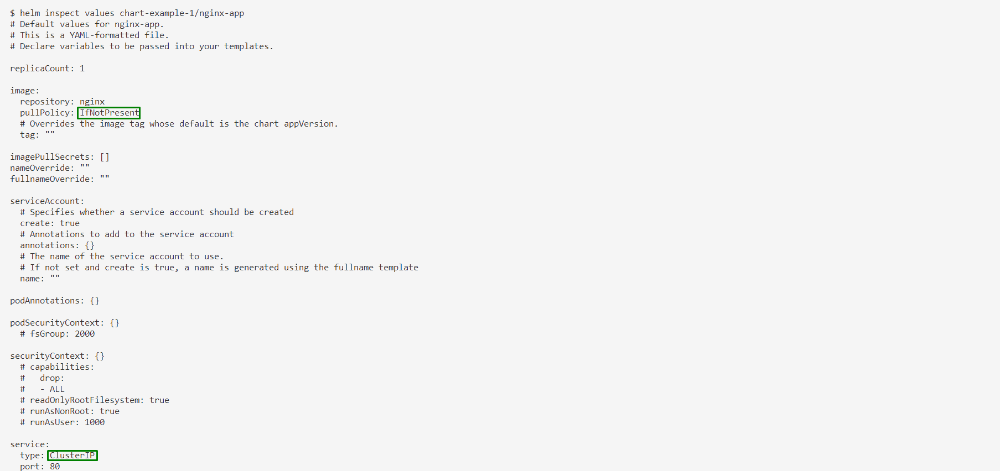

Let's change the default `service type` in `values.yaml` as shown in the image:

```bash
helm inspect values chart-example-1/nginx-app
```

* service: NodePort

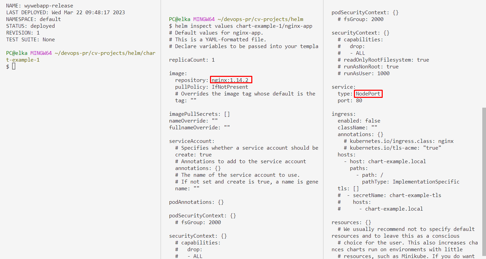

Apply the changes by supplying our release name and chart name. Let's find it out first:

```bash
helm list -a
helm upgrade mywebapp-release nginx-app
```

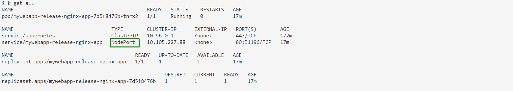

Now we can access the nginx app we deployed with helm using the following command:

```bash
minikube service mywebapp-release-nginx-app
```

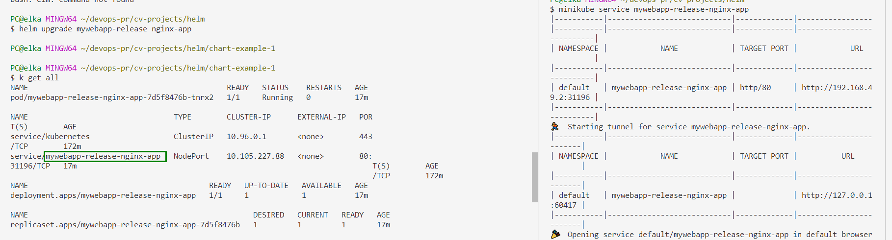

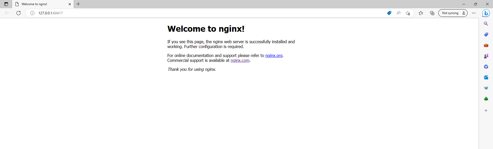

It was easy right!

### Alternative

If we didn't use helm, we could still edit the nginx service file traditionally using the following commands:

```bash
kubectl create deployment nginx --image=nginx --dry-run=client -o yaml >> webapp1/templates/nginx.yaml
kubectl create deployment nginx --image=nginx
kubectl expose deploy nginx --port 80 --type NodePort --dry-run=client -o yaml >> webapp1/templates/service.yaml
```

<!-- 
## Templating


 -->

<!-- 
## Display info to the user

Add the following to the NOTES.txt file. 

```
servicename=$(k get service -l "app={{ .Values.appName }}" -o jsonpath="{.items[0].metadata.name}")
kubectl --namespace {{ .Values.namespace}} port-forward service/{{ .Values.appName }} 8888:80
```

`helm upgrade mywebapp-release nginx-app/ --values nginx-app/values.yaml`

`kubectl --namespace default port-forward service/myhelmapp 8888:80`


 -->

## Useful commands

**helm list**

This command lists all of the releases for a specified namespace (uses current namespace context if namespace not specified).


```bash
helm list
```


**kubectl get events**


```bash
kubectl get events -w
```

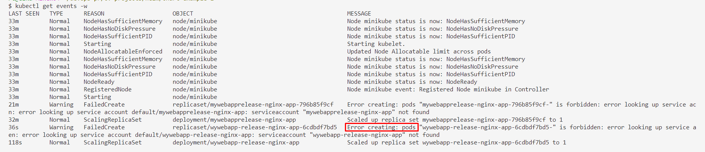

In the above example you can see that there is no pod created after installing helm since I accidentally deleted service account file.

**helm history**

History prints historical revisions for a given release

```bash
helm history
```

**helm package ./nginx-app**

Let's package our chart to share. You can package your manifests using the following command: 

```bash
helm package ./nginx-app
```
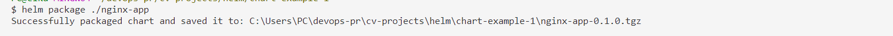

Yeah i am working on my resume projects alongwith aws cloud project bootcamp 🎢. And I hope to challenge myself with dynamodb this week! Anyway, let's delete our release.


## Clean up

**helm uninstall** 

Uninstall the release and remove all of the resources associated with the last release of the chart: 

```bash
helm uninstall mywebapp-release
```

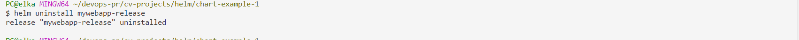


See you in another project 👋


